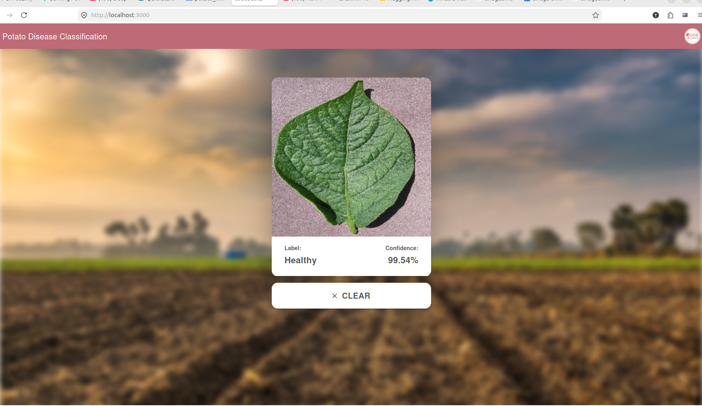

This system leverages a custom-trained Convolutional Neural Network (CNN) to perform automated visual inspections of potato foliage. By analyzing the unique spatial patterns and color variances on the leaf surface, the model can distinguish between healthy tissue and common pathogenic threats with high precision.

    Feature Extraction: The model uses multiple convolutional layers to detect microscopic patterns, such as the concentric rings typical of Early Blight or the dark, water-soaked spots characteristic of Late Blight.

    Data-Driven Accuracy: Trained on thousands of images from the PlantVillage dataset, the network has learned to generalize across various lighting conditions and leaf orientations.

    Softmax Classification: The final layer outputs a probability distribution across three classes, providing not just a prediction, but a confidence score for every scan.

    Low-Latency Inference: The architecture is optimized to process images in milliseconds, making it suitable for field deployment on mobile devices or edge servers.


# 🥔 Potato Disease Classifier
[](https://fastapi.tiangolo.com/)
[](https://tensorflow.org/)
[](https://www.docker.com/)
[](https://huggingface.co/spaces/tinegadev/potato_disease_classifier)

An end-to-end deep learning solution for real-time plant pathology. This system classifies potato leaf images into three categories with **~98% accuracy**, helping farmers mitigate crop loss through early detection.
### 🌐[Live Demo on Render](https://potato-model-rm11.onrender.com/) 

### 🌐 | 🚀 [API Docs (Swagger)](https://tinegadev-potato-disease-classifier.hf.space/docs)

---


## 🎯 Key Capabilities
* **Real-time Classification:** Detects Early Blight, Late Blight, and Healthy leaves.
* **Optimized Inference:** Uses Keras 3 `TFSMLayer` for efficient legacy model execution.
* **Cloud Native:** Fully containerized with Docker and deployed as a microservice architecture.
* **Responsive UI:** A React-based frontend for seamless user interaction.

## 🏗️ Architecture
The project follows a modern ML-Ops workflow:
1.  **Model:** CNN trained on the PlantVillage dataset (TensorFlow).
2.  **Backend:** FastAPI wrapper providing a `/predict` endpoint.
3.  **Deployment:** API hosted on **Hugging Face Spaces** (Docker) and Frontend hosted on **Render**.


## 🛠️ Tech Stack
| Component | Tech Used |
| :--- | :--- |
| **Deep Learning** | TensorFlow 2.15, Keras 3 |
| **Backend API** | FastAPI, Uvicorn |
| **Frontend** | React, Axios, CSS3 |
| **DevOps** | Docker, Git, Hugging Face Hub |
| **Image Handling** | Pillow, NumPy |

## 📁 Project Structure
```text
.
├── api/
│   ├── main.py          # FastAPI application logic
│   ├── requirements.txt # Python dependencies
│   └── 4/               # Exported SavedModel (v4)
├── frontend/            # React source code
├── models/              # Research notebooks & training logs
└── README.md
```

## 🚀 Local Development

### 1. Run via Docker
To mirror the production environment:
```bash
docker build -t potato-classifier .
docker run -p 7860:7860 potato-classifier
```

### 2. Run TF Serving (Alternative)
If you prefer serving the model independently:
```bash
sudo docker run -p 8501:8501 \
  --name potato_container \
  --mount type=bind,source=$(pwd)/api/4,target=/models/potato_model/1 \
  -e MODEL_NAME=potato_model \
  -t tensorflow/serving
```

## 📝 License
## 📜 License
Distributed under the Apache License 2.0. See `LICENSE` for more information.
---
**Developed with ❤️ by [Your Name/Tinega]**


## 📜 License
Distributed under the Apache License 2.0. See `LICENSE` for more information.